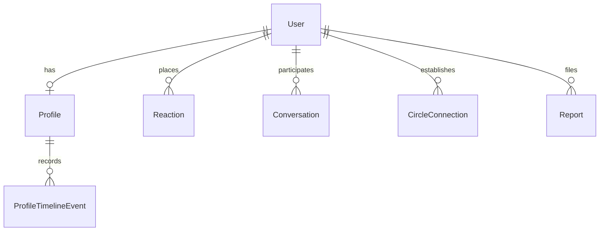
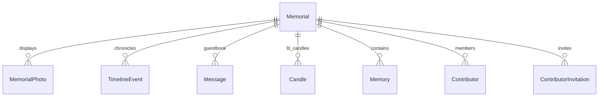

# Eterna Project Analysis & Technical Specification Report

Eterna is a **memory preservation platform** designed with a handcrafted, journal-style scrapbook aesthetic. Guided by the philosophy that *"every life is a story worth remembering,"* it intentionally rejects the attention-retention mechanics of modern social media (likes, counts, infinite scrolling, algorithmic feeds) and focuses purely on storytelling, heritage preservation, and genuine family connection.

This document serves as the comprehensive technical documentation and system architecture breakdown of the Eterna codebase.

---

## 🏗️ System Architecture Overview

Eterna is built on a decoupled Single Page Application (SPA) architecture:

```mermaid
graph TD
    subgraph Frontend (React SPA)
        A[Vite Dev/Build Tool] --> B[React Router v7]
        B --> C[Tailwind CSS v4]
        C --> D[Framer Motion Animations]
        B --> E[Axios API Client]
    end
    
    subgraph Backend (Django REST Framework)
        E --> F[Django REST API Wrapper]
        F --> G[Token Authentication]
        F --> H[Model Layer & Bleach Sanitizer]
        H --> I[SQLite / PostgreSQL Database]
        H --> J[Media Storage & Pillow Optimizer]
    end
```

* **Frontend**: React 19, Vite 8, Tailwind CSS v4, Framer Motion, and Lenis for smooth wobbly scrolling.
* **Backend**: Python 3.11, Django 4.2, Django REST Framework, Whitenoise (static file delivery), and Pillow (image optimizing).
* **Database**: SQLite in development; PostgreSQL configured for production.

---

## 🗂️ Database Schema & Data Models

The system architecture utilizes **4 major apps** mapped across Django's model layer.

### 1. `users` App (Profiles, Connections, Messaging)
Handles user settings, privacy settings, direct messaging, reports, and reactions.



* **`Profile`**: One-to-one with Django `User`. Extends details with `display_name`, `bio`, `profile_image`, `public_search`, `tags`, and `privacy_setting` (`PUBLIC`, `CONNECTIONS_ONLY`, or `PRIVATE`).
* **`Reaction`**: A generic polymorphic model supporting reactions (`like`, `love`, `support`) on different entities (such as Memorials and Tales).
* **`Conversation`**: A chat room model connecting participants. Supports blocking via `is_blocked` and `blocked_by`.
* **`DirectMessage`**: The message entity within a `Conversation`. Supports text content, image attachments, and auto-sanitization on save.
* **`CircleConnection`**: A peer-to-peer social mapping between users. Statuses include `PENDING`, `ACCEPTED`, `DECLINED`, and `BLOCKED`. Connection types are `FRIEND`, `FAMILY`, and `SUPPORTER`.
* **`ProfileTimelineEvent`**: Personal biography milestones connected to user profiles.
* **`Report`**: Polymorphic reporting model using `GenericForeignKey` to flag content (`SPAM`, `HARASSMENT`, `FAKE_ACCOUNT`, `INAPPROPRIATE_CONTENT`).

### 2. `memorials` App (The core memory space)
Manages memorial notebooks, contributor roles, timelines, and interactive tributes.



* **`Memorial`**: The primary entity representing a deceased loved one. Holds biographical data, profile/cover photos, visibility controls (`PUBLIC`, `FAMILY_ONLY`, `PRIVATE`), and connection tags.
* **`MemorialPhoto`**: A gallery image item representing Polaroid snapshots in the scrapbook.
* **`TimelineEvent`**: A chronological milestone (e.g., birth, marriage, achievements) displayed in a vertical timeline.
* **`Message`**: Heartfelt guestbook entries left by visitors.
* **`Candle`**: Represents virtual lit candles with user tribute messages.
* **`Memory`**: Stories shared by authorized contributors. Supports photo attachments and voice note uploads.
* **`ExperienceTag`**: Shared categories connecting memorial pages (e.g., `Lost Grandmother`, `Lost Father`, `Pet Loss`, `Caregiver`).
* **`Contributor`**: Maps user access levels to a Memorial:
  * `OWNER`: Full administrative controls.
  * `FAMILY_MEMBER`: Can add memories, gallery pictures, and timeline milestones.
  * `EDITOR`: Can update biography and profile details.
* **`ContributorInvitation`**: Pending contributor invitations sent by memorial owners.

### 3. `tales` App (Chronicles & Stories)
Enables users to write multi-chapter stories and family diaries.
* **`Tale`**: Represents a book/story title, description, and author. Generates clean web URLs via slug fields.
* **`Chapter`**: Represents chapters in a tale, ordered chronologically or sequentially.

### 4. `communities` App (Support Groups & Noticeboards)
Shared support groups focusing on grief journeys and shared experience circles.
* **`Community`**: Represents a support group. Stores title, rules, welcome message, icon, and privacy options (`PUBLIC` or `PRIVATE`).
* **`Membership`**: Tracks member roles within communities (`ADMIN`, `CO_ADMIN`, `MEMBER`).
* **`CommunityJoinRequest`**: Pending access requests for private/approval-required support groups.
* **`CommunityMessage`**: Messages posted to the community feed noticeboard. Supports image attachments and soft deletion.
* **`CommunityBan`**: Bannings issued to keep support groups safe and respectful.

---

## 🔒 Security Implementations & Code Verification

Eterna has a rigorous set of server-side validation and security protections applied across all models:

### 1. HTML Sanitization (Stored XSS Prevention)
To prevent stored XSS, all text fields that support user input (bios, stories, titles, and comments) are passed through `bleach.clean()` in the Django `save()` hook:
```python
if self.story:
    self.story = bleach.clean(self.story, tags=[], strip=True)
```
This forces all inputs to be clean, raw text, stripping out potential script injection vectors before they are written to the database.

### 2. Media Upload Validation
Backend validation in [validators.py](file:///e:/Eterna/users/validators.py) intercepts all file uploads to enforce safety constraints:
* **Image Validator (`validate_image_file`)**:
  * Restricts file size to a maximum of **5MB**.
  * Validates file extensions against a strict whitelist: `.jpg`, `.jpeg`, `.png`, `.webp`.
  * Verifies MIME headers (`image/jpeg`, `image/png`, `image/webp`).
  * Performs deep byte verification using Pillow (`Image.open(..).verify()`) to check for corrupted files or disguised executable scripts.
* **Audio Validator (`validate_audio_file`)**:
  * Restricts voice note size to a maximum of **10MB**.
  * Restricts extensions to `.mp3`, `.wav`, `.m4a`.
  * Checks MIME type headers.
  * Validates magic byte signatures (e.g., verifying `RIFF` and `WAVE` headers for `.wav`, `ID3`/`\xff\xfb` for `.mp3`, and `ftyp` for `.m4a`).

### 3. Image Optimization
The backend resizes large images automatically during upload to save bandwidth and improve page load speeds. The `optimize_image` utility:
* Captures the uploaded file stream.
* Resizes any image exceeding a width or height of **1200px** using Lanczos interpolation while preserving aspect ratio.
* Converts all images to optimized **WebP** formats at **80% quality**.
* Renames the file extension to `.webp` before writing to storage.

---

## 🎨 Frontend Features & Custom Interactive Components

Eterna’s frontend avoids generic SaaS layouts, using modern React styling alongside hand-drawn SVG art overlays, paper textures, and responsive animations.

### Core Interactive Elements:

| Component | File Path | Description |
| :--- | :--- | :--- |
| **3D Notebook Hero** | [Interactive3DNotebook.jsx](file:///e:/Eterna/frontend/src/components/Home/Interactive3DNotebook.jsx) | A 3D-perspective vintage sketchbook. Tilts dynamically according to mouse coordinates. |
| **Draggable Corkboard** | [DoodleCorkboard.jsx](file:///e:/Eterna/frontend/src/components/Home/DoodleCorkboard.jsx) | An interactive community message board. Allows users to write/doodle on sticky notes, pin them with wobbly rotations, and drag them around. Positions persist in local storage. |
| **Cassette Audio Player** | [CassetteTapePlayer.jsx](file:///e:/Eterna/frontend/src/components/Memorial/CassetteTapePlayer.jsx) | A vintage cassette deck graphic. Simulates tape reel rotation animations and sound visualizer waves during voice note playback. |
| **Candle Lighting** | [InteractiveCandle.jsx](file:///e:/Eterna/frontend/src/components/Memorial/InteractiveCandle.jsx) | An interactive candle-lighting element. Features custom SVG vectors with jittery flame wobble animations simulating real candlelight. |
| **Exit Intent Tear Note** | [ExitIntentHook.jsx](file:///e:/Eterna/frontend/src/components/layout/ExitIntentHook.jsx) | Intercepts tab/window closures. Displays a wobbly paper strip that must be dragged down to reveal a dynamic quote. |
| **Sketch Drawing Mode** | [DoodleOverlay.jsx](file:///e:/Eterna/frontend/src/components/layout/DoodleOverlay.jsx) | Enables a freehand canvas drawing overlay across the entire site when "Sketch Mode" is active, with mobile touch support. |

---

## ⚙️ REST API Endpoint Catalog

All API endpoints are prefixed with `/api/`.

### Memorials & Interactions
* `GET /api/memorials/` — List public memorials (paginated).
* `POST /api/memorials/` — Create a memorial (auth required).
* `GET /api/memorials/<id>/` — Retrieve detail view of a memorial.
* `PATCH /api/memorials/<id>/` — Update a memorial (owner/editor).
* `DELETE /api/memorials/<id>/` — Delete a memorial (owner).
* `POST /api/memorials/<id>/memories/` — Add a memory block (auth required).
* `POST /api/memorials/<id>/messages/` — Leave a guestbook message.
* `POST /api/memorials/<id>/candles/` — Light a virtual tribute candle.
* `POST /api/memorials/<id>/photos/` — Upload a polaroid gallery picture (auth required).
* `POST /api/memorials/<id>/timeline/` — Add a chronological timeline event (auth required).

### Contributors & Invites
* `GET /api/memorials/<id>/contributors/` — List active contributors.
* `POST /api/memorials/<id>/contributors/invite/` — Send contributor invitation (owner).
* `GET /api/memorials/invitations/` — View pending contributions dashboard (auth required).
* `POST /api/memorials/invitations/<id>/respond/` — Accept/decline invite (auth required).

### User Authentication
* `POST /api/auth/login/` — Authenticate credentials.
* `POST /api/auth/logout/` — End current session.
* `POST /api/auth/register/` — Register a new account.
* `GET /api/auth/me/` — Retrieve authenticated user profile metadata.
